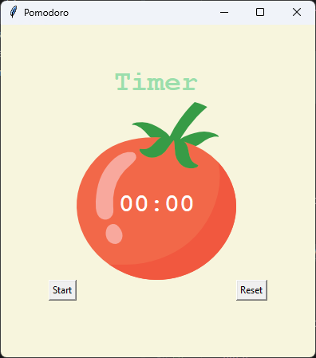

# 🍅 Pomodoro Timer

A simple Pomodoro Timer built with Python and Tkinter.

This application follows the Pomodoro productivity technique:

- 25 minutes of focused work
- 5 minute short breaks
- 20 minute long break after four work sessions
- Visual progress tracking with checkmarks

## Screenshot

<p align="center">
  
</p>

## Features

- Work and break session management
- Automatic session switching
- Long break after 4 Pomodoro sessions
- Progress tracking using checkmarks
- Reset functionality
- Clean Tkinter-based user interface

## Requirements

- Python 3.8+
- Tkinter (included with most Python installations)

## Project Structure

```text
.
├── main.py
├── tomato.png
└── README.md
```

## Installation

Clone the repository:

```bash
git clone https://github.com/Amin-Afshari/pomodoro-timer.git
cd pomodoro-timer
```

Run the application:

```bash
python main.py
```

## How It Works

### Work Session

- Duration: 25 minutes
- Timer label turns green

### Short Break

- Duration: 5 minutes
- Occurs after every work session
- Timer label turns pink

### Long Break

- Duration: 20 minutes
- Occurs after every four work sessions
- Timer label turns red

### Progress Tracking

A checkmark (✔) is added after each completed work session.

Example:

```text
✔
✔✔
✔✔✔
✔✔✔✔
```

## Technologies Used

- Python
- Tkinter

## Future Improvements

- Sound notifications
- Desktop notifications
- Dark mode
- Custom work/break durations
- Session statistics
- Save progress between launches

## License

This project is open source and available under the MIT License.